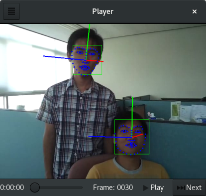
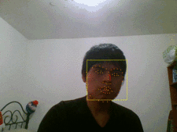
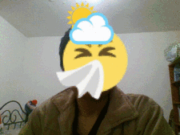

# GStreamer Cheese Plugins

This repository contains some face detection utilities that are developed to be
applied to Cheese an possibly other GStreamer based webcam software. This is in
development stage yet.

## Dependencies

* gstreamer-1.0
* opencv
* dlib

## Build

```
mkdir builddir
cd builddir
meson .. --prefix=$PREFIX_PATH --buildtype=release
ninja
ninja install
```

### Build with Flatpak

The easiest way to try this is with flatpak. This procedure will also take care of building the dependencies.

Clone submodules:

    git submodule update --init --recursive

Install the flathub remote. See https://flatpak.org/setup/

Istall the GNOME SDK:

    flatpak install org.gnome.Sdk//3.32

Run the build script:

    ./tools/build-flatpak.sh

Install the built flatpak bundle:

    sudo flatpak install --bundle io.github.cfoch.gst_plugins_cheese.flatpak

## Usage

Firstly, you need a trained shape (landmark) predictor. You can get one from
[*dlib-modes* ](https://github.com/davisking/dlib-models/blob/master/shape_predictor_68_face_landmarks.dat.bz2)

## Usage from Flatpak

If you have built a flatpak, start a bash interpreter in the sandbox with:

    flatpak run --command=bash io.github.cfoch.gst_plugins_cheese

And then run the commands below, the ones starting with `gst-launch-1.0 ...`.

### Facedetect filter

A filter that based on OpenCV and dlib detects the face, landmark and
pose estimation (of people's faces). It also use the Hungarian Algorithm to
keep match faces and thus keep the sense of order of faces in the next frames.


```
gst-launch-1.0 v4l2src ! videoconvert ! cheesefacedetect scale-factor=0.3 landmark=shape_predictor_68_face_landmarks.dat use-hungarian=true display-landmark=true display-pose-estimation=true display-id=true ! videoconvert ! xvimagesink
```

### Faceomelette filter

A funny animation that based on *GstCheeseFaceDetect* overlays an omelette
in the faces of people in the captured frames.


```
gst-launch-1.0 v4l2src ! videoconvert ! cheesefaceomelette scale-factor=0.3 landmark=shape_predictor_68_face_landmarks.dat ! videoconvert ! xvimagesink
```

### Examples

#### Stepper
A tool that may help you to see what happens frame by frame.



```
python3 stepper.py -v people.ogv -l shape_predictor_68_face_landmarks.dat
```

### Facetrack filter

A filter that based on OpenCV and dlib detects multiple faces and track them.
This filter is more "smooth" than _gstcheesefacedetect_, since it uses a Median
Flow tracker. It works by detecting faces in the first frame and tracking them
in the next N frames, and repeating this cycle. In the case the tracker loses
its target, faces are detected again and remapped with the Hungarian Algorithm.

More information can be found in this [document](https://cfoch.github.io/assets/tesis/tesis.pdf)


```
gst-launch-1.0 v4l2src ! videoconvert ! cheesefacetrack scale-factor=0.5 landmark=shape_predictor_68_face_landmarks.dat display-landmark=true ! videoconvert ! xvimagesink
```

### Faceoverlay filter

A filter that linked to _gstcheesefacetrack_ can overlay images over facial
keypoints of tracked faces. Multiple images can be assigned to one face for
different facial keypoints and per frame and duration, so an complex animation
can be created.

More information can be found in this [document](https://cfoch.github.io/assets/tesis/tesis.pdf)



```
gst-launch-1.0 v4l2src ! videoconvert ! cheesefacetrack scale-factor=0.5 landmark=shape_predictor_68_face_landmarks.dat display-landmark=true ! videoconvert ! faceoverlay location=sprite.json ! videoconvert ! xvimagesink
```

Example of JSON file:
```json
[
    {
        "left-eye": {
            "rotate": true,
            "loop": true,
            "base-scale-factor": 1.0,
            "frames": [
                {
                    "base-scale-factor": 0.4,
                    "duration": 1,
                    "location": "/path/to/gst-plugins-cheese/docs/img/eye.png"
                }
            ]
        },
        "right-eye": {
            "rotate": true,
            "loop": true,
            "base-scale-factor": 1.0,
            "frames": [
                {
                    "base-scale-factor": 0.4,
                    "duration": 1,
                    "location": "/path/to/gst-plugins-cheese/docs/img/eye.png"
                }
            ]
        }
    }
]
```

## License

LGPLv2
