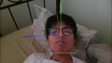
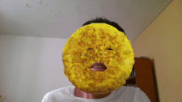

# GStreamer Cheese Plugins

This repository contains some face detection utilities that are developed to be
applied to Cheese an possibly other GStreamer based webcam software. This is in
development stage yet.

## Dependencies

* gstreamer-1.0
* opencv
* dlib

## Build

```
mkdir builddir
cd builddir
meson .. --prefix=$PREFIX_PATH --buildtype=release
ninja
ninja install
```

## Usage

Firstly, you need a trained shape (landmark) predictor. You can get one from
[*dlib-modes* ](https://github.com/davisking/dlib-models/blob/master/shape_predictor_68_face_landmarks.dat.bz2)

### Facedetect filter

A filter that based on OpenCV and dlib detects the face, landmark and
pose estimation (of people's faces). It also use the Hungarian Algorithm to
keep match faces and thus keep the sense of order of faces in the next frames.


```
gst-launch-1.0 v4l2src ! videoconvert ! cheesefacedetect scale-factor=0.3 landmark=shape_predictor_68_face_landmarks.dat use-hungarian=true display-landmark=true display-pose-estimation=true display-id=true ! videoconvert ! xvimagesink
```

### Faceomelette filter

A funny animation that based on *GstCheeseFaceDetect* overlays an omelette
in the faces of people in the captured frames.


```
gst-launch-1.0 v4l2src ! videoconvert ! cheesefaceomelette scale-factor=0.3 landmark=shape_predictor_68_face_landmarks.dat ! videoconvert ! xvimagesink
```

### Examples

#### Stepper
A tool that may help you to see what happens frame by frame.


```
python3 stepper.py -v people.ogv -l shape_predictor_68_face_landmarks.dat
```

## License

LGPLv2
